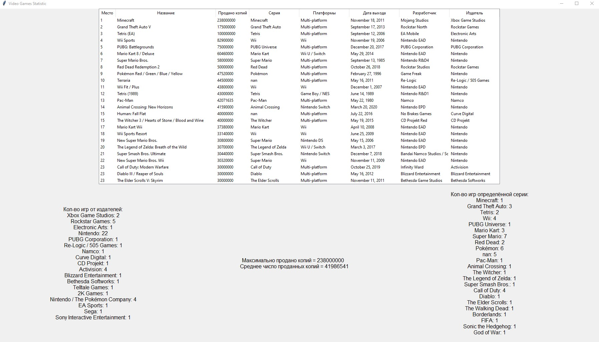
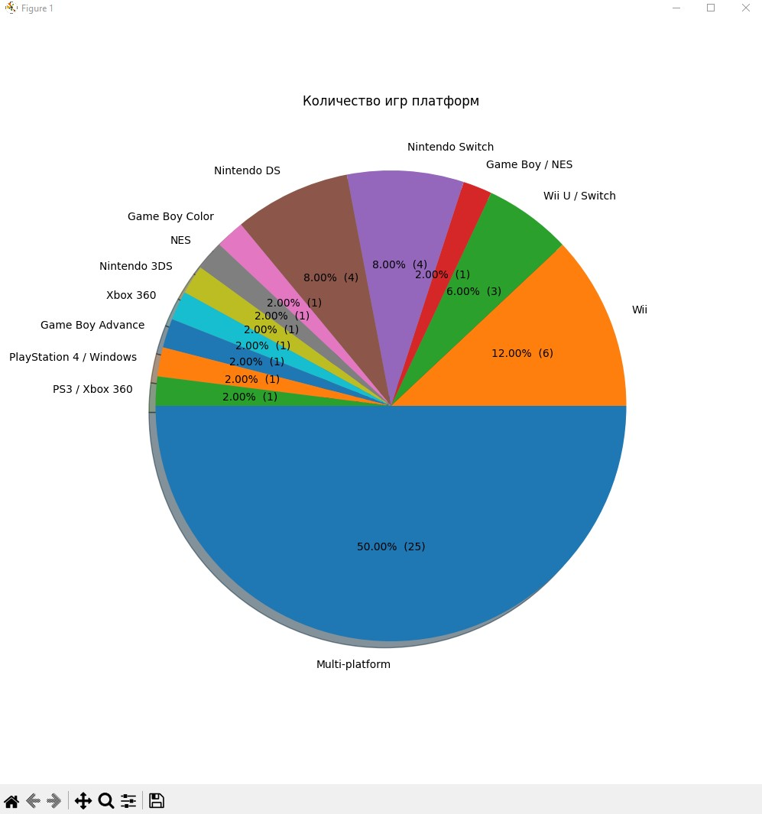
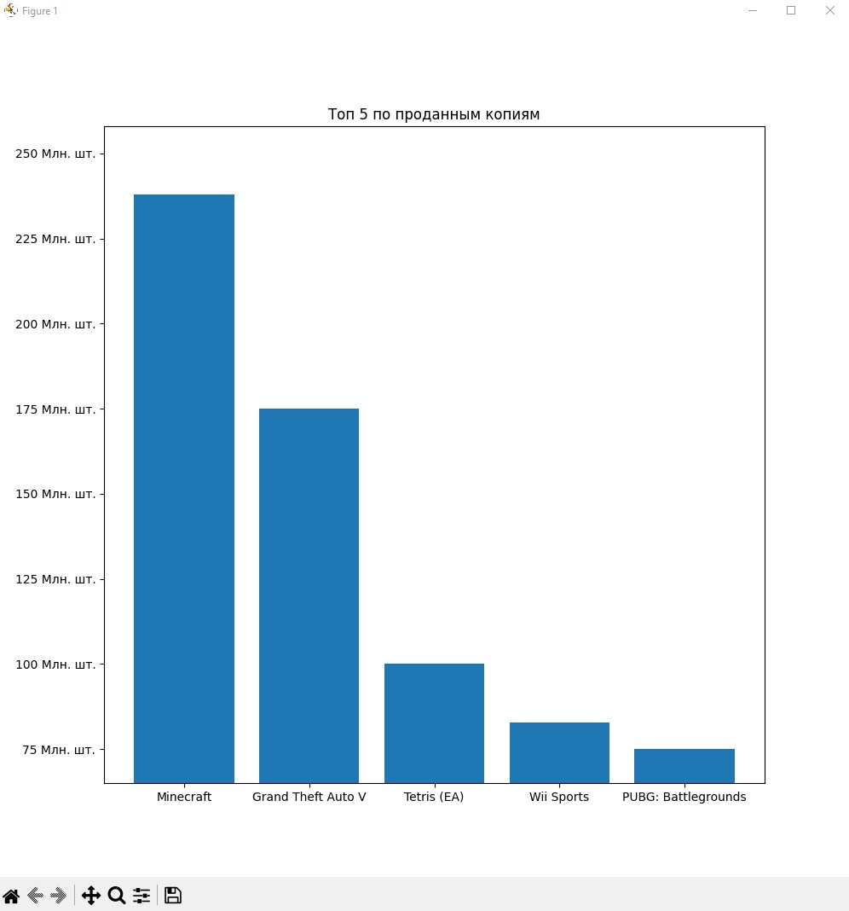

<p align = "center">МИНИСТЕРСТВО НАУКИ И ВЫСШЕГО ОБРАЗОВАНИЯ<br>
РОССИЙСКОЙ ФЕДЕРАЦИИ<br>
ФЕДЕРАЛЬНОЕ ГОСУДАРСТВЕННОЕ БЮДЖЕТНОЕ<br>
ОБРАЗОВАТЕЛЬНОЕ УЧРЕЖДЕНИЕ ВЫСШЕГО ОБРАЗОВАНИЯ<br>
«САХАЛИНСКИЙ ГОСУДАРСТВЕННЫЙ УНИВЕРСИТЕТ»</p>
<br><br><br><br><br><br>
<p align = "center">Институт естественных наук и техносферной безопасности<br>Кафедра информатики<br>Коньков Никита Алексеевич</p>
<br><br><br>
<p align = "center">Итоговая работа<br><strong>«Программирование на языке Python».</strong><br>01.03.02 Прикладная математика и информатика</p>
<br><br><br><br><br><br><br><br><br><br><br><br>
<p align = "right">Научный руководитель<br>
Артём Владимирович Лоскутов</p>
<br><br><br>
<p align = "center">г. Южно-Сахалинск<br>2023 г.</p>
<br><br><br><br><br><br><br><br><br><br><br><br>

<br>
<h1 align = "center">Цель</h1>

<p style="font-size: large;">Найти любой источник данных в интернете, загрузить с помощью pandas, посчитать основные статистики, построить произвольные графики в matplotlib </p>

<h1 align = "center">Решение</h1>

```python

import pandas as pd
import matplotlib.pyplot as plt
import tkinter as tk
import collections as colls
from tkinter import *
from tkinter import ttk
import statistics as stat

#Чтение файла
games = pd.read_csv("BestSellingVideoGamesOfAllTime.csv")

#Создание окна
window = Tk()
window.geometry('1800x1000')
window.title("Video Games Statistic")

#Создание таблицы
cols=("rank","title","sales","series","platform(s)","release_date","developer(s)","publisher(s)")
tree = ttk.Treeview(window, columns=cols, show="headings")
tree.configure(height=25)

tree.heading("rank", text="Место")
tree.heading("title", text="Название")
tree.heading("sales", text="Продано копий")
tree.heading("series", text="Серия")
tree.heading("platform(s)", text="Платформы")
tree.heading("release_date", text="Дата выхода")
tree.heading("developer(s)", text="Разработчик")
tree.heading("publisher(s)", text="Издатель")

tree.column("rank", width=50, stretch=True)
tree.column("title", width=300, stretch=True)
tree.column("sales", width=100, stretch=True)
tree.column("series", width=150, stretch=True)
tree.column("platform(s)", width=150, stretch=True)
tree.column("release_date", width=150, stretch=True)
tree.column("developer(s)", width=150, stretch=True)
tree.column("publisher(s)", width=150, stretch=True)


#Заполнение таблицы
for i in range(0, len(games)):
    c1=games.loc[i, "Rank"]
    c2=games.loc[i, "Title"]
    c3=games.loc[i, "Sales"]
    c4=games.loc[i, "Series"]
    c5=games.loc[i, "Platform(s)"]
    c6=games.loc[i, "Initial release date"]
    c7=games.loc[i, "Developer(s)"]
    c8=games.loc[i, "Publisher(s)"]
    tree.insert("", END, values=(c1,c2,c3,c4,c5,c6,c7,c8))

#Подсчет статистики

def useful_stat():

    lbltxt = "Кол-во игр от издателей:"
    data= colls.Counter(games["Publisher(s)"])
    for item, value in data.items():
        lbltxt += f"\n{str(item)}: {str(value)}"
    lbl1=Label(window, text=lbltxt, font=15)
    lbl1.pack(side=tk.LEFT, ipadx=150)

    lbltxt = "Максимально продано копий = "
    data = games["Sales"]
    max_sales = max(data)
    lbltxt += f"{max_sales} \n Среднее число проданных копий = {int(stat.mean(data))}"

    lbl2=Label(window, text=lbltxt, font=15)
    lbl2.pack(side=tk.LEFT, ipadx=150)

    lbltxt = "Кол-во игр определённой серии:"
    data= colls.Counter(games["Series"])
    for item, value in data.items():
        lbltxt += f"\n{str(item)}: {str(value)}"
    lbl3=Label(window, text=lbltxt, font=15)
    lbl3.pack(side=tk.LEFT, ipadx=150)

#Графики

def graphs():

    #pie график подсчитывающий количество игр определённых платформ из топа
    fig, ax = plt.subplots(figsize=(10, 10))
    data = colls.Counter(games["Platform(s)"])
    x = data.keys()
    y = data.values()
    ax.pie(y, labels=x, autopct=make_autopct(y), shadow=True, startangle=180)
    plt.title('Количество игр платформ')
    plt.show()

    #График проданных копий
    fig, ax = plt.subplots(figsize=(10, 10))
    ax.yaxis.set_major_formatter(millions)
    n = 5
    data = games["Sales"][:n]
    x = []
    for i in range(0, n):
        x.append(games["Title"][i])
    y = data
    ax.bar(x, y)
    plt.title(f'Топ {n} по проданным копиям')
    plt.ylim((min(y - 10000000), max(y + 20000000)))
    plt.show()


#Для графиков (формат отображения значений)
def make_autopct(values):
    def my_autopct(pct):
        total = sum(values)
        val = int(round(pct*total/100.0))
        return '{p:.2f}%  ({v:d})'.format(p=pct,v=val)
    return my_autopct

def millions(x, pos):
    return f'{int(x*1e-6)} Mлн. шт.'

tree.pack()
useful_stat()
graphs()
window.mainloop()

```

<h2 align = "center">Итог</h2>

<p align = "center"></p>
<p align = "center"></p>
<p align = "center"></p>